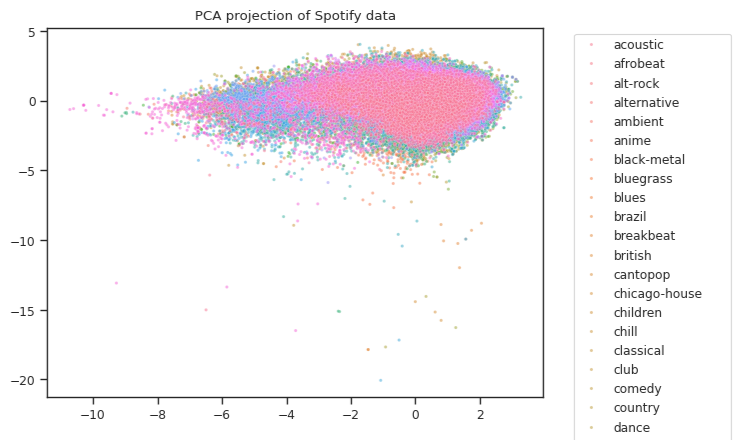
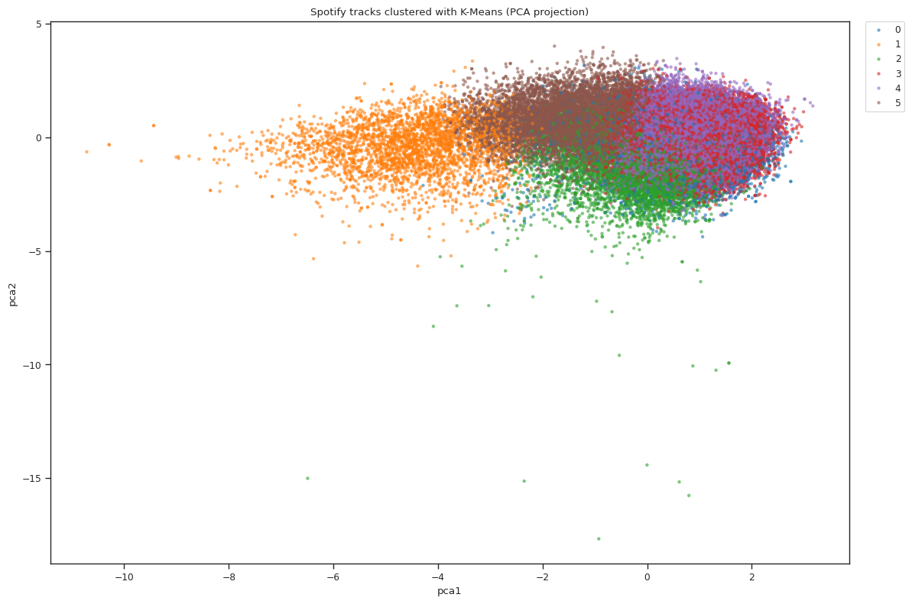
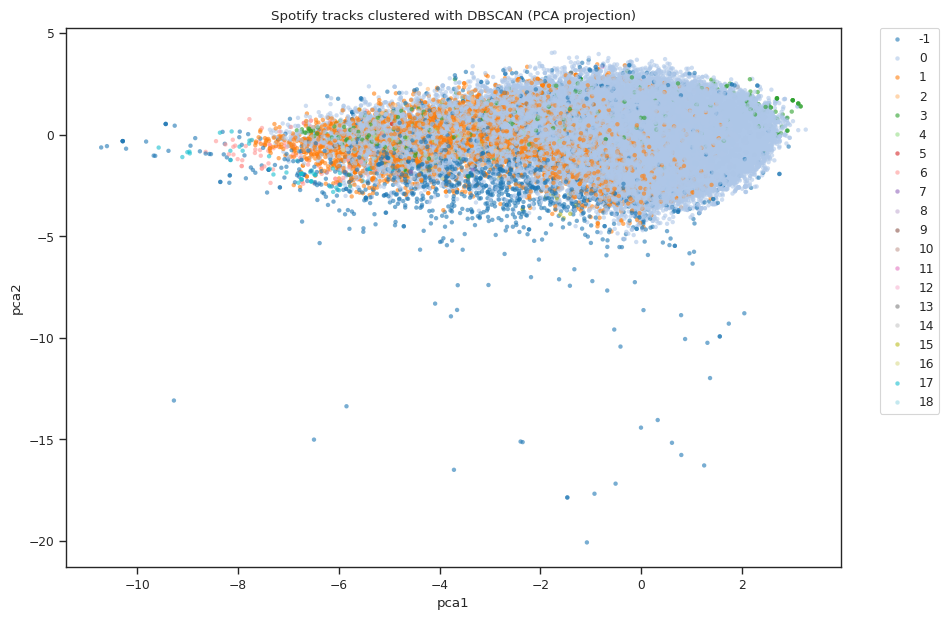

# **🎶 Spotify Songs Clustering with K-Means & DBSCAN**
## **📌 Project Overview**
This project separation Spotify tracks with unsupervision algorytms : DBSCAN and K-Means.

## **📂 Dataset**
Source: Kaggle
Link: https://www.kaggle.com/datasets/maharshipandya/-spotify-tracks-dataset/data
Size: 114000 data
Features: numerical audio attributes (danceability, energy, acousticness, …), plus metadata (genre, popularity, explicit, duration_ms)
## **⚙️ Methods**
Preprocessing:
-  delete poems with missing data
-  change object columns to categories
-  delete unnecessary columns
-  make heatmaps
Dimensionality reduction:
CA (2D) and UMAP (2D) for visualization
Clustering:
- K-Means algotytm separation data for 6 similar size clusters. This speparation in my opision is nice, but unfortunatly K-Means alghorytm don't make outliers who in this case study are nessesary.

- DBSCAN algorytm sepraration data for 19 diffrent size clusters. This separation is worst than in K-Means algorytm, but this algorytm find 2607 outliers, what in this case study is important.

-Comparision and conclusions:
### DBSCAN vs K-Means

| Algorithm | Clusters | Outliers | Main insight |
|-----------|----------|----------|--------------|
| DBSCAN    | 19       | 2607     | One huge mainstream cluster + smaller niches |
| K-Means   | 6        | –        | Balanced partitioning into large groups |

Probably the best option will be mix DBSCAN (search outliers) and K-Means (data separation).
## **🚀 Future Work**
- Try Gaussian Mixture Models (GMM) for probabilistic clustering.
- Build a simple recommendation demo in Streamlit.
